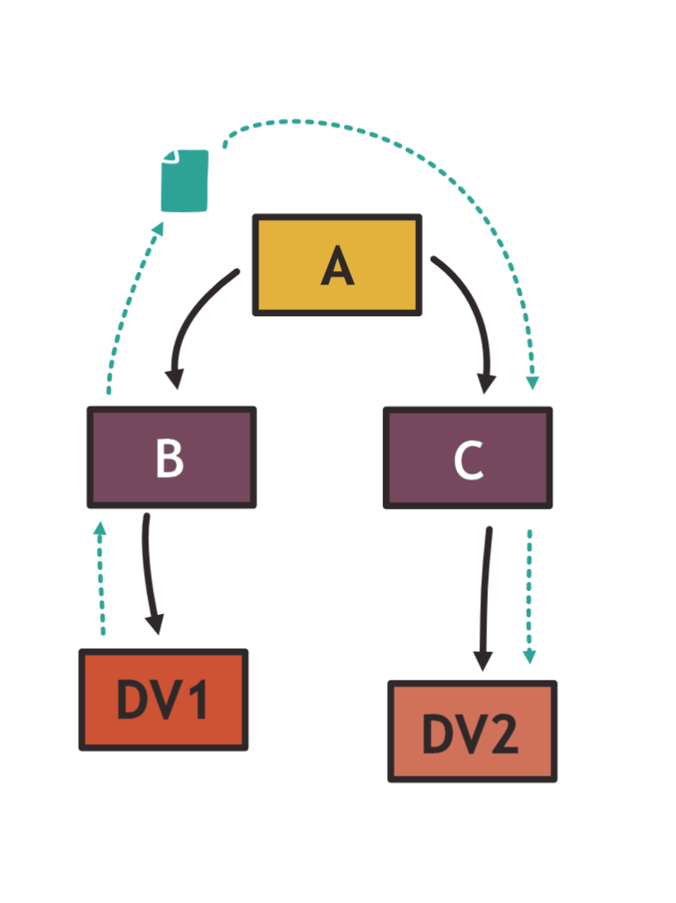
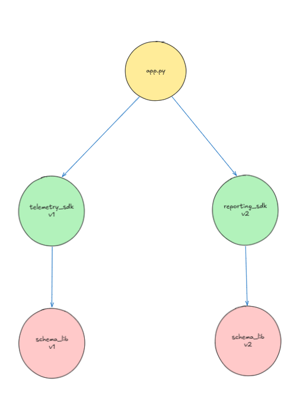
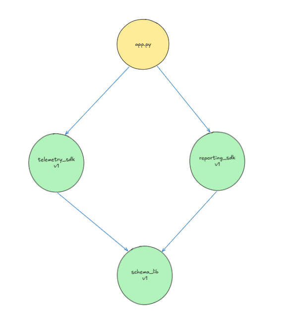
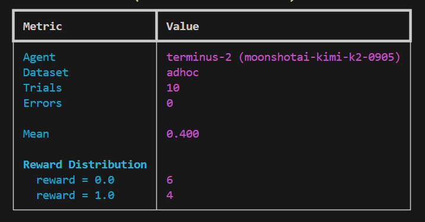

# Broken Python Diamond Conflict

## Task Description

This is a Harbor benchmark task that challenges an agent to diagnose and fix a
broken Python service caused by a [diamond dependency
conflict](https://jlbp.dev/what-is-a-diamond-dependency-conflict).

A diamond dependency conflict is a scenario where two or more libraries in a dependency tree 
consume a common library using versioned references, and none of the common library versions 
in those references contain all of the features that the consumers expect. Consequently, it 
is not possible to select a set of versions that form a working program.



The agent is given a Docker container with a running Flask service. The service appears 
healthy at startup (health checks pass), but a key request path fails at runtime. 
The agent must identify the root cause in the dependency tree, make the minimal correct 
change to requirements.txt, and reinstall so the fix survives a cold start.

The task tests whether a model can:
1. Diagnose a version-compatibility failure without obvious stack traces at startup
2. Understand which dependency version satisfies all callers
3. Make a declarative fix (changing the pinned requirement) rather than mutating SDK source
4. Reinstall packages so the running environment matches the new requirements

---

## The Application

[environment/app.py](environment/app.py) is a small Flask service with three endpoints:

### `GET /health`

Health probe. Returns `{"status": "ok"}` with HTTP 200. Always passes even in
the broken state.

### `POST /ingest`

Accepts a JSON event payload (`source`, `event`, optional `user_id`). Validates
that both `source` and `event` are present, then:

1. Calls `telemetry_sdk.encode_event(payload)` to normalize and tag the event
2. Calls `reporting_sdk.build_report_record(payload)` to build a structured report record
3. Appends both outputs to an in-memory list
4. Returns HTTP 202 with the raw telemetry and report payloads

Returns HTTP 400 if `source` or `event` is missing.

**In the broken state:** this endpoint returns HTTP 500 because `telemetry_sdk`
calls `schema_lib.normalize_event(..., drop_empty=True)` and the installed
`schema_lib` is v2, which does not accept `drop_empty`.

### `GET /reports/summary`

Returns aggregated counts of all ingested events, grouped by source:

```json
{"total": 3, "sources": {"web": 2, "mobile": 1}}
```

---

## The Dependency Graph

The service depends on three vendored packages inside `environment/packages/`:

```
app.py
  ├── telemetry-sdk  (v1.4.0)           uses schema_lib.normalize_event(drop_empty=True)
  ├── reporting-sdk  (v1 or v2)         uses schema_lib.normalize_event(...)
  └── schema-lib     (v1.8.2 or v2.1.0) provides normalize_event(...)
```

API Contracts of each SDK:

| Package              | Version | `normalize_event` signature                         | Compatible with `telemetry_sdk`? |
|----------------------|---------|-----------------------------------------------------|----------------------------------|
| `schema_lib_v1`      | 1.8.2   | `normalize_event(payload, *, drop_empty=False)`     | **Yes** — accepts `drop_empty`   |
| `schema_lib_v2`      | 2.1.0   | `normalize_event(payload, *, required_fields=())`   | **No** — `drop_empty` is unknown |
| `reporting_sdk_v1`   | 1.9.0   | calls `normalize_event(payload, drop_empty=True)`   | Yes (depends on schema_lib_v1)   |
| `reporting_sdk_v2`   | 2.2.0   | calls `normalize_event(payload, required_fields=…)` | No (declares dep on schema_lib_v2) |
| `telemetry_sdk`      | 1.4.0   | calls `normalize_event(payload, drop_empty=True)`   | Only with schema_lib_v1          |

---

## The Diamond Dependency Conflict

`telemetry_sdk` and `reporting_sdk_v2` both depend on `schema-lib` but need
different versions:



When Python tries to call `schema_lib.normalize_event(payload, drop_empty=True)`
via `telemetry_sdk`, it blows up:

```
TypeError: normalize_event() got an unexpected keyword argument 'drop_empty'
```

Current broken `requirements.txt`:

```
Flask==3.0.3
schema-lib @ file:///app/packages/schema_lib_v2     ← wrong version
telemetry-sdk @ file:///app/packages/telemetry_sdk
reporting-sdk @ file:///app/packages/reporting_sdk_v2  ← wrong branch
```

---

## The Ideal Fix (Step by Step)

The resolution is to choose the branch where **all consumers are satisfied** —
which means switching to `reporting_sdk_v1` (which also uses `drop_empty=True`
and depends on `schema_lib_v1`), so the whole dependency tree can converge on
`schema_lib_v1`.



**Step 1 — Identify the failing call**

Run the service and hit `POST /ingest`. The 500 response body or the Flask log
will show:

```
TypeError: normalize_event() got an unexpected keyword argument 'drop_empty'
```

Trace it: `app.py` → `telemetry_sdk.encode_event()` → `schema_lib.normalize_event(..., drop_empty=True)`.

**Step 2 — Inspect the installed schema_lib**

```bash
python -c "import schema_lib; import inspect; print(inspect.signature(schema_lib.normalize_event))"
# (payload, *, required_fields=()) — this is v2, incompatible
```

**Step 3 — Survey the vendored alternatives**

```bash
ls /app/packages/
# reporting_sdk_v1/  reporting_sdk_v2/  schema_lib_v1/  schema_lib_v2/  telemetry_sdk/
```

Check `schema_lib_v1`:
```bash
grep -n "def normalize_event" /app/packages/schema_lib_v1/schema_lib/__init__.py
# def normalize_event(payload: dict, *, drop_empty: bool = False) -> dict:
```

v1 accepts `drop_empty`. Also check `reporting_sdk_v1`:
```bash
grep -n "normalize_event" /app/packages/reporting_sdk_v1/reporting_sdk/formatter.py
# normalized = normalize_event(payload, drop_empty=True)  ← same calling convention
```

Both `telemetry_sdk` and `reporting_sdk_v1` call `normalize_event` with
`drop_empty=True`. Switching to the v1 branch makes the tree consistent.

**Step 4 — Edit `requirements.txt`**

```bash
# Change this:
# schema-lib @ file:///app/packages/schema_lib_v2
# reporting-sdk @ file:///app/packages/reporting_sdk_v2

# To this:
schema-lib @ file:///app/packages/schema_lib_v1
reporting-sdk @ file:///app/packages/reporting_sdk_v1
```

**Step 5 — Reinstall and verify**

```bash
pip install --no-cache-dir --force-reinstall -r /app/requirements.txt
python /app/app.py &
curl -s http://localhost:8000/health
curl -s -X POST http://localhost:8000/ingest \
  -H 'Content-Type: application/json' \
  -d '{"source":"web","event":"click","user_id":"u-1"}'
curl -s http://localhost:8000/reports/summary
```

All three should return success. The reinstall step is required — the verifier
checks the live installed package, not just the text in `requirements.txt`.

**What not to do:**
- Do not modify `telemetry_sdk/encoder.py` to remove `drop_empty=True` — the verifier checks this
- Do not modify `reporting_sdk_v2/pyproject.toml` to point at v1 — the verifier checks this file is unchanged
- Do not patch `schema_lib_v2` to add a `drop_empty` parameter — keeps v2 installed, fails structural checks
- Do not inline the normalization logic directly into `app.py` — bypasses the SDK

---

## How It Is Tested ([tests/test_outputs.py](tests/test_outputs.py))

The verifier runs 9 pytest tests split across four classes:

### `TestHealthEndpoint` (1 test)

- `test_health_status`: `GET /health` returns HTTP 200 and `{"status": "ok"}`

### `TestIngestEndpoint` (2 tests)

- `test_ingest_accepts_valid_event`: `POST /ingest` with a valid payload returns HTTP 202, and the response contains `schema_version = "1.8.2"` in both `telemetry` and `report` — confirming `schema_lib_v1` is live
- `test_ingest_validates_required_fields`: `POST /ingest` without `event` returns HTTP 400

### `TestReportingFlow` (1 test)

- `test_summary_aggregates_sources`: ingest from two different sources, then `GET /reports/summary` returns `total >= 2` with correct per-source counts

### `TestDependencyFixes` (5 tests) — structural guardrails

These tests prevent superficial fixes from passing by checking the actual files
and the installed runtime state:

| Test | What it checks |
|------|----------------|
| `test_requirements_select_compatible_reporting_branch` | Active (non-commented) lines in `requirements.txt` reference `schema_lib_v1` and `reporting_sdk_v1`, not v2 variants |
| `test_inactive_v2_branch_metadata_is_unchanged` | `reporting_sdk_v2/pyproject.toml` still declares `schema-lib-v2` as its dependency — ensures the agent did not mutate the v2 package to point at v1 |
| `test_selected_v1_branch_metadata_is_still_consistent` | `reporting_sdk_v1/pyproject.toml` is intact and still references `schema_lib_v1` |
| `test_telemetry_sdk_was_not_rewritten_around_conflict` | `telemetry_sdk/encoder.py` still calls `normalize_event(payload, drop_empty=True)` — ensures the agent did not remove the call that drives the requirement |
| `test_installed_schema_version_is_legacy_compatible` | Spawns a Python subprocess and imports `schema_lib` at runtime; calls `normalize_event({'event':'x'}, drop_empty=True)` and asserts the returned `schema_version` is `"1.8.2"` — confirms packages were actually reinstalled |

The last test (`test_installed_schema_version_is_legacy_compatible`) is what
trips agents that correctly edit `requirements.txt` but forget to run
`pip install --force-reinstall`. The requirements file is fixed, but the
running Python environment still has `schema_lib_v2` installed.

---

## Results

**Best run:** `jobs/2026-04-01__21-06-05_BEST_RUN`  
**Model:** Kimi K2 (`moonshotai/kimi-k2-0905`) via the `terminus-2` agent  
**Trials:** 10  
**Score:** 4 / 10 (mean = 0.4)



### Outcome by trial

| Trial | Result | Tests passed | Root failure |
|-------|--------|--------------|--------------|
| `mRbVRss` | PASS | 9 / 9 | — |
| `erujfzv` | PASS | 9 / 9 | — |
| `58Vs2pN` | PASS | 9 / 9 | — |
| `DUruTfa` | PASS | 9 / 9 | — |
| `j8wK7ju` | FAIL | 8 / 9 | Correctly updated `requirements.txt` to use v1 SDKs and left all vendor source unchanged, but **did not run `pip install --force-reinstall`**. The live installed schema_lib was still v2, so the runtime import check failed. |
| `R486uxs` | FAIL | 6 / 9 | Did not switch requirements to v1. Left telemetry_sdk untouched. The app still had schema_lib_v2 installed, causing the ingest endpoint and schema version checks to fail. |
| `XXfq3dU` | FAIL | 5 / 9 | Did not switch requirements. Also mutated `telemetry_sdk/encoder.py` to remove `drop_empty=True`, making ingest work around the conflict but breaking the structural `test_telemetry_sdk_was_not_rewritten_around_conflict` check. |
| `3bwAkd6` | FAIL | 5 / 9 | Same pattern as XXfq3dU — mutated telemetry_sdk to remove `drop_empty`, did not fix requirements. |
| `qHFCQhH` | FAIL | 5 / 9 | Same pattern as XXfq3dU. |
| `dbkgeV9` | FAIL | 5 / 9 | Same pattern as XXfq3dU. |

### Failure pattern summary

**"Hack the caller" pattern (4 trials):** The model diagnosed that `telemetry_sdk`
was calling `normalize_event` with an unsupported keyword. Instead of switching
to a compatible `schema_lib`, it patched `telemetry_sdk/encoder.py` to remove
the `drop_empty=True` call. This makes the app functional but represents the
wrong fix — the verifier rejects it because `telemetry_sdk` must remain
untouched.

**"Forgot to reinstall" pattern (1 trial):** The model correctly identified the
root cause and updated `requirements.txt`, but did not follow up with
`pip install --force-reinstall`. All file-level checks passed; only the runtime
import test failed.

**"Partial fix" pattern (1 trial):** The model did not switch requirements at
all, so the schema_lib_v2 remained installed and multiple tests failed.

**Full correct pattern (4 trials):** Switch `requirements.txt` to
`schema_lib_v1` + `reporting_sdk_v1`, run `pip install --force-reinstall`,
restart the app. All 9 tests pass.

